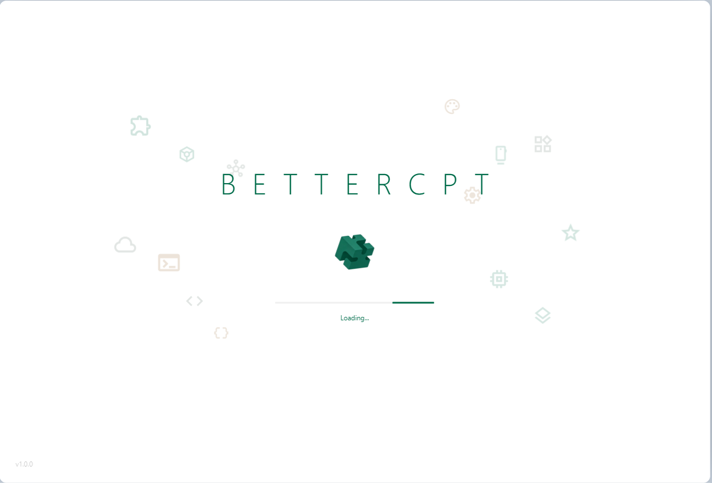
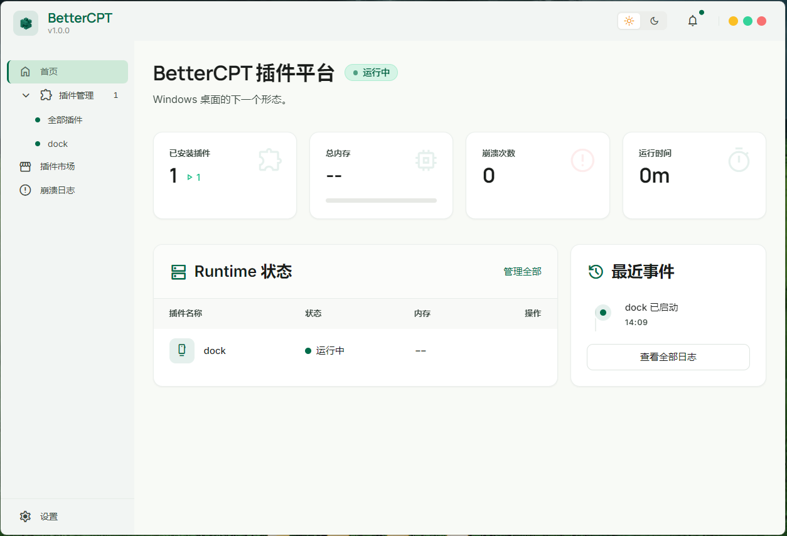
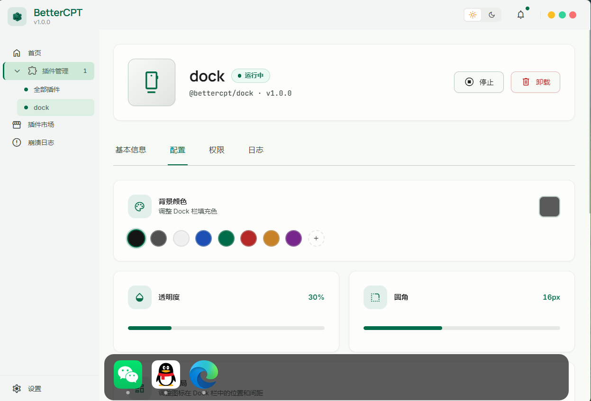
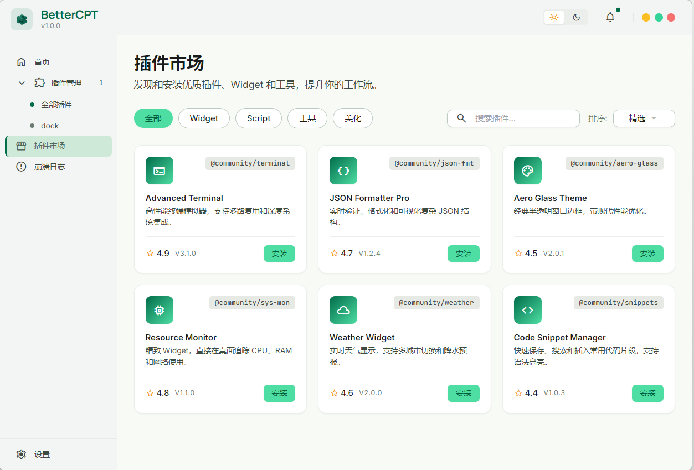

# BetterCPT

<div align="center">

  **让 Windows 桌面活起来**

  用 JavaScript 写桌面 Widget —— Dock 栏、天气卡片、系统监控、快捷启动器。

  轻量 · 可编程 · 崩溃自恢复

  [](LICENSE)
  [](https://www.microsoft.com/windows)
  [](https://github.com/EvanLofton/BetterCPT/releases)

</div>

---

##  这是什么

BetterCPT 是一个 Windows 桌面插件平台。你可以用纯 JavaScript 编写常驻桌面的视觉组件 —— 就像给桌面装上"小程序"。

Rainmeter 太老、Electron 太重。BetterCPT 取两者之长：**极低内存占用 + 现代 JavaScript 开发体验**，10 个 Widget 内存不到 50MB。

##  工作原理

```
  你写的 JS 插件
      ↓
  Deno Core V8 引擎 (Rust)
      ↓
  Qt 6.5 GPU 渲染 (C++ 子进程)
      ↓
  Windows 桌面显示
```

Host 持有所有状态，Qt 只做渲染。插件崩溃不影响其他 Widget，重启自动恢复 —— 架构上的鲁棒性，不靠运气。

##  截图

<div align="center">
  
  
</div>

<div align="center">
  
  
</div>

##  特性

| 特性 | 说明 |
|---|------|
|  **轻量** | 10 个 Widget 内存 < 50MB，闲置 CPU 接近零 |
|  **GPU 渲染** | Qt 6.5 硬件加速，144Hz 丝滑动画 |
|  **JavaScript** | 用 JS 写插件，无需 C++ 或 Lua |
|  **崩溃恢复** | 单个 Widget 崩溃不影响其他，3 秒内自动恢复 |
|  **Dashboard** | 可视化管理：安装/启动/停止/卸载插件，实时监控状态 |
|  **拖放创建** | 拖 `.exe` 或 `.lnk` 到 Dock，自动提取图标，点击启动 |
|  **可定制** | 命令行 API，不限制你的创造力 |

##  5 分钟上手

### 安装

从 [Releases](https://github.com/EvanLofton/BetterCPT/releases) 下载安装包，一路下一步。Windows 10+ 自带 WebView2 运行时，无需额外安装。

### 写一个插件

```javascript
// my-widget/index.js
var card = createRect({
  width: 200, height: 120,
  x: 100, y: 100,
  radius: 16,
  color: "rgba(30, 30, 30, 0.85)"
});

card.onClick(function () {
  system.launch("C:/Windows/System32/calc.exe");
});
```

```json
// my-widget/manifest.json
{
  "id": "@local/my-widget",
  "runtime": "widget",
  "capabilities": ["widget:overlay"],
  "permissions": ["storage"],
  "entry": "index.js"
}
```

放到 `plugins/` 目录，启动 BetterCPT，你的 Widget 就出现在桌面上了。

📖 完整文档：[插件开发指南](docs/SDK_DEVELOPER_GUIDE.md)

##  为什么不用...

| 方案 | 问题 |
|------|------|
| Rainmeter / Desktop Widgets | Lua 脚本、无现代工具链、扩展性弱 |
| Electron / WebView 方案 | 每个 Widget 15-25MB，10 个直逼 300MB |
| 自研 GUI 框架 | 工作量爆炸，focus/IME/clipboard 会失控 |

BetterCPT 另辟蹊径：**Host 用 Rust 保稳定，渲染用 Qt 保流畅，插件用 JS 保开发体验**。

##  技术创新

### 1. 宿主唯一状态源架构

所有 Widget 状态由 Rust Host 持有，Qt 子进程只是"渲染镜像"。Qt 崩溃后，Host 从状态树重建所有 Widget —— 用户感知不到任何变化。这是与 Electron/WebView 方案的**本质架构差异**。

### 2. 命令式 SDK，而非声明式框架

不做 Virtual DOM，不做 Hooks，不做响应式系统。`createRect()` → `setScale()` → `onClick()`。简单、可预测、零魔法。开发者完全掌控渲染时机。

### 3. Build-first Runtime

插件的 TypeScript、多文件拆分、npm 依赖 —— 全部在构建时由 esbuild 解决。Runtime 只执行一份 `bundle.js`，极致简单。这是 Figma / VSCode 同款模型。

### 4. per-plugin V8 Isolate 隔离

每个插件运行在独立的 V8 Isolate 中。一个插件的死循环、内存泄漏、GC 压力不影响其他插件。架构上把"插件"当"微服务"对待。

##  技术栈

| 层 | 技术 |
|---|------|
| Host | Rust + tokio + Tauri v2 |
| 渲染 | C++ Qt 6.5 (独立子进程) |
| 插件引擎 | Deno Core (V8 Isolate) |
| 管理后台 | React + Tailwind CSS (Tauri WebView) |
| IPC | JSON-RPC 2.0 (stdin/stdout pipe) |

##  路线图

- [x] Phase 0-4: 核心平台（Dock 插件、Dashboard、崩溃恢复）
- [ ] Phase 5: 性能优化（Batch IPC、多线程、TypeScript 支持）
- [ ] Phase 5: 生态建设（插件市场、自动更新、更多 Capability）
- [ ] v2: 插件市场 + 签名审核 + 跨平台探索

详见 [ROADMAP.md](docs/ROADMAP.md) 和 [FUTURE_CAPABILITIES.md](docs/FUTURE_CAPABILITIES.md)。

##  从源码构建

```bash
git clone https://github.com/EvanLofton/BetterCPT.git

# 构建 Qt 渲染器
cd widget-qt && cmake -B build && cmake --build build

# 构建 Rust Host
cd ../host && cargo build

# Dashboard 前端
cd ../dashboard && npm install && npm run build

# 运行
cd ../host && cargo run
```

##  协议

MIT License · [@EvanLofton](https://github.com/EvanLofton)

---

<div align="center">
  <sub>Built with Rust  · Qt  · Deno Core · Tauri</sub>
</div>
